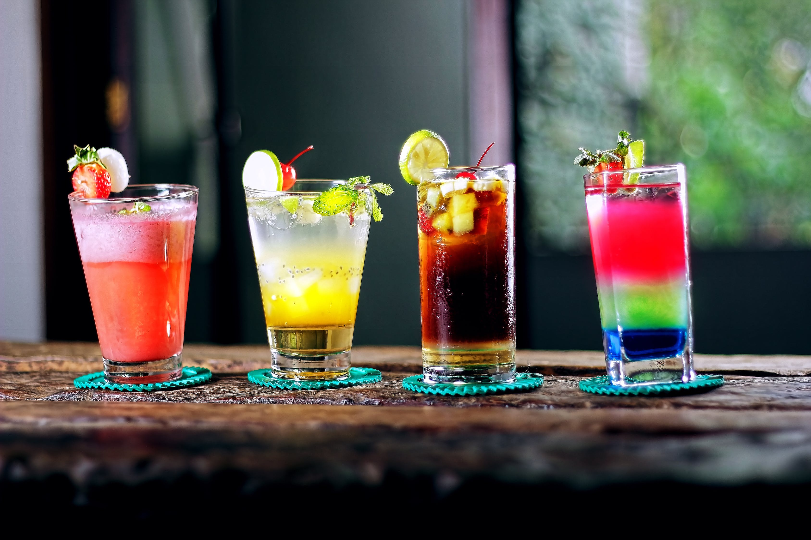

# Mister Coktails

A simple Rails CRUD app that can be used to build a database of cocktails with doses and ingredients.
- See list of cocktails
- Write/Edit cocktails.
- Write/Edit doses.
- Ingredients are seeded via API.
- Create cocktails by describing the dosage of each ingredient.

### Installation Instructions
```bash
 bundle && yarn 
 rails db:create db:migrate db:seed
 rails s
```
Open http://localhost:3000/


Project developed @ Le Wagon Bootcamp.



